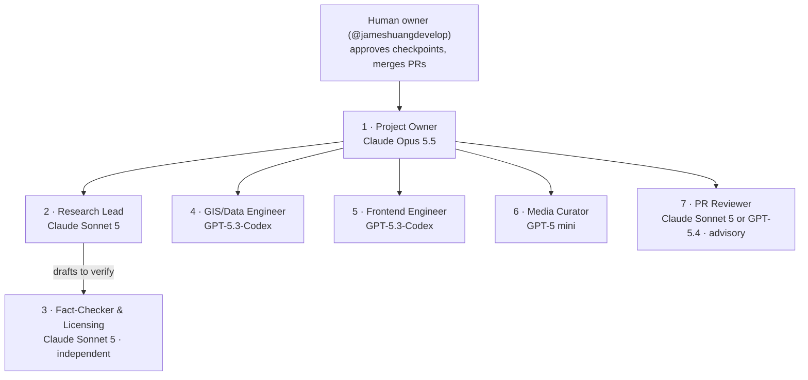

# Checkpoints

Each checkpoint is a PR labeled `checkpoint`. Its description gives a summary, the decisions needed, and the budget used. **All agents pause at a checkpoint until @jameshuangdevelop merges the PR or comments "approved".**

| CP | Milestone | Deliverable | Status | PR |
|---|---|---|---|---|
| CP0 | M0 Setup & Plan | Plan, org chart, budget forecast | Approved 2026-09-23 | #2 |
| CP1 | M1 Research & Options | Source inventory with licenses; stack options with pricing; human picks the stack; ADRs recorded | Approved 2026-09-23 | #3–#7 |
| CP2 | M2 Schema & Core Data | Final schema and validation CI; 40 verified core sites; verification report | **Awaiting review** | |
| CP3a | M3 MVP App | Low-fidelity visual spec and mockup | Not started | |
| CP3b | M3 MVP App | Working MVP deployed to a preview | Not started | |
| CP4 | M4 Ancient Layer & Timeline | Modern↔Ancient toggle, ancient provinces and roads, timeline that snaps to change years | Not started | |
| CP5 | M5 Routes Tab | Paul's journeys and well-attested Jesus segments, with citations | Not started | |
| CP6+ | M6 Expansion | About 50 verified locations per batch, one checkpoint per batch, up to about 300 | Not started | |
| CP7 | M7 Mobile-web polish | Responsive layout, touch gestures, performance | Not started | |

---

## CP0 — Setup & Plan

### Org chart

Agent definitions are in `.github/agents/`. Model choices and fallbacks are in ADR-0003, and the reviewer's vendor rule is in ADR-0004 ([DECISIONS.md](docs/DECISIONS.md)).

### Plan
**How work flows.** The PO writes a task card. The human opens a new Copilot Chat, picks the agent and model on the card, and pastes it. The agent works on its own branch, commits, and prints the push and PR commands. The human runs `pr-reviewer` on the PR and merges. Cards for a milestone are written when it starts, so each one builds on the latest results. When the human asks the PO to drive from Copilot CLI, the PO runs the cards as subagents instead (ADR-0007).

**M1 — Research & Options** (the first two cards are ready)

| ID | Task | Agent | Branch | Starts after |
|---|---|---|---|---|
| [M1-01](docs/tasks/M1-01-source-inventory.md) | Source inventory with licenses | research-lead | `docs/m1-source-inventory` | CP0 (runs in parallel with M1-02) |
| [M1-02](docs/tasks/M1-02-stack-options.md) | Stack and hosting options with pricing, plus learning resources | gis-engineer | `docs/m1-stack-options` | CP0 (runs in parallel with M1-01) |
| M1-03 | License verification of the inventory; first `docs/LICENSES.md` decisions | fact-checker | `docs/m1-license-review` | M1-01 merged |
| M1-04 | CP1 summary; ADRs for the stack the human picks | project-owner | `docs/cp1-summary` | M1-01 to M1-03 merged |

**Later milestones** (outline; `→` means "then", `‖` means "in parallel")
- **M2:** schema and validation CI (GIS) → 40 core sites in 2 batches (Research) ‖ images for each batch (Media) → verification (Fact-Checker) → CP2.
- **M3:** visual spec (PO) → CP3a → app scaffold and CI (Frontend) → map, pins and zoom tiers → details panel → candidate sites and search → preview deploy → CP3b.
- **M4:** timeline events (Research) ‖ ancient layers (GIS) → verification → toggle and timeline UI (Frontend) → CP4.
- **M5:** route segments (Research) → verification → routes tab (Frontend) → CP5.
- **M6:** batches of about 50 (Research → Media → Fact-Checker), one checkpoint each.
- **M7:** responsive layout, touch and performance (Frontend) → CP7.

### Budget forecast
About **27,000 AI credits for the whole project** (range 15k–55k, roughly US$150–550), which is under 3% of the 1,000,000-credit monthly cap. Budget does not set the pace; review time at each checkpoint does. A 1,500-credit session guard catches runaway sessions. Details and model rates: [docs/BUDGET.md](docs/BUDGET.md).

### Risks
- **Data licenses.** Some candidate sources may carry share-alike terms that decide the data license. M1-03 settles this before any data is written.
- **Merge conflicts** on `docs/PROGRESS.md` and `docs/BUDGET.md` from parallel branches. Mitigation: each task edits only its own row (ADR-0006).
- **Model availability.** Plans or policies can block a model. The agent files list fallbacks, and the PO records any substitution.
- **Checkpoint wait time.** Every agent pauses at each checkpoint, so review speed sets the schedule.

### Decisions needed from you
1. **Approve the plan and org chart.** Merge the PR or comment "approved".
2. **Models:** confirm that the models in ADR-0003 are enabled for your account, and tell the PO about any that are blocked.
3. **Create the `checkpoint` label.** The command is in the PR description.
4. *Optional:* protect `main` (require a PR and block force pushes) so the "never push to `main`" rule is enforced. Recommended.
5. *Optional:* with this much budget headroom, the Fact-Checker could use Claude Opus 5.5 instead of Sonnet 5 for stronger verification, at about 2k extra credits over the project. **PO recommendation:** stay on Sonnet 5 for now, following the brief's "cheapest model that does the task well" rule, and revisit at CP2 after the first verification report.

---

## CP1 — Research & Options

**Outcome:** approved as recommended on 2026-09-23 (#7). ADR-0008 to ADR-0011 and ADR-0013 are Accepted.

### What was delivered
| Task | Output | Branch (merge in this order) |
|---|---|---|
| M1-00 | CP0 recorded; ADR-0007 (the PO drives from Copilot CLI) | `docs/m1-kickoff` |
| M1-01 | [Source inventory](docs/research/SOURCES.md): 12 sources, licenses read at each source, and a 10-place ID spot-check | `docs/m1-source-inventory` |
| M1-02 | [Stack options](docs/research/STACK_OPTIONS.md) with pricing, and a [learning list](docs/research/LEARNING.md) | `docs/m1-stack-options` |
| M1-03 | [License review](docs/verification/M1.md): content licenses decided in [LICENSES.md](docs/LICENSES.md) and [ATTRIBUTION.md](ATTRIBUTION.md) | `docs/m1-license-review` |
| M1-04 | This summary, and the proposed stack ADRs | `docs/cp1-summary` |

Each branch, M1-00 to M1-04, was reviewed by the PR Reviewer from a different vendor than its author (ADR-0004). Every must-consider finding was fixed in a follow-up commit on that branch before the PRs were opened.

### Decisions needed from you
**Merging this PR accepts every recommendation below.** To choose differently, comment on the PR, and the PO will update the ADRs before you merge.

| # | Decision | Recommendation | Runner-up | Monthly cost at 1k / 50k visits | ADR |
|---|---|---|---|---|---|
| 1 | Map library | **MapLibre**: `react-map-gl/maplibre` on web, `@maplibre/maplibre-react-native` for native later | Mapbox | $0 / $0 | ADR-0008 |
| 2 | Modern basemap | **OpenFreeMap**, with contested borders hidden using the `disputed` flag. It has no uptime guarantee, so a fallback style must be wired in before launch. | Protomaps PMTiles self-hosted on Cloudflare R2 | $0 / $0 (Mapbox tiles would cost about $650 at 50k) | ADR-0009 |
| 3 | Ancient mode | **Our own GeoJSON overlays** (provinces for each timeline year, roads, coastlines) on a neutral base | Our own PMTiles archive, if the data grows | $0 / $0 | ADR-0009 |
| 4 | Hosting | **Cloudflare Pages**, with preview deploys from GitHub Actions | Vercel ($20 at 50k) | $0 / $0 | ADR-0010 |
| 5 | Backend | **None for the MVP**: static JSON files and client-side search | Cloudflare Workers + D1 | $0 / $0 | ADR-0011 |
| 6 | WEB edition | **`engwebp`** (US spelling). Both options are public domain, 66-book, and use "LORD". | `engwebpb` (British spelling) | — | ADR-0013 |

**For your information (already decided by the Fact-Checker; brief §2.4):** code is MIT, geometry derived from OpenStreetMap or AWMC in `data/geo/` is ODbL 1.0, all other data and content is CC BY-SA 4.0, and WEB text stays public domain (ADR-0012).

**What you'll need to do later (in M3, not now):** create a free Cloudflare account and add a Pages deploy token to the repository's GitHub secrets, so CI can publish preview deploys. The M3 card will give the exact steps.

### Concepts for you
- **Vector tiles and a style.** The map is drawn in your browser from small data tiles, following a style file. Changing the style (for example hiding contested borders) needs no new data. [MapLibre docs](https://maplibre.org/maplibre-gl-js/docs/)
- **GeoJSON overlay.** Our own shapes (provinces, roads) are drawn on top of the basemap from plain JSON files. [RFC 7946](https://datatracker.ietf.org/doc/html/rfc7946)
- **Share-alike.** Anyone who reuses our data must release their version under the same license. This is why the data is CC BY-SA 4.0 and the OSM-derived geometry is ODbL. [CC BY-SA 4.0](https://creativecommons.org/licenses/by-sa/4.0/)
- The full learning list is in [LEARNING.md](docs/research/LEARNING.md).

### Risks
- **OpenFreeMap has no SLA.** Mitigation: the M3 card requires tile-error monitoring and a config-switchable fallback style before launch.
- **Share-alike data.** Every data PR must record its source so that ODbL-derived fields never leak into CC BY-SA records (LICENSES.md rule). The Fact-Checker checks this in M2.
- **Stacked PRs.** These must be merged in the order shown above, or a later PR will pull in earlier commits.

### Budget
M1 used about **2,800 AI credits** (forecast ~2,200; the review-and-fix rounds were the extra cost), and the month total is about **3,300 of 1,000,000 (0.3%)**. See [BUDGET.md](docs/BUDGET.md).

### Next (after you approve)
The PO writes the M2 cards. First the schema and validation CI (GIS Engineer), then the 40 core sites in 2 batches (Research Lead, then Media Curator and Fact-Checker), and then CP2.

---

## CP2 — Schema & Core Data

### What was delivered
| Task | Output | PR / branch (merge in this order) |
|---|---|---|
| M2-00 | CP1 recorded, the M2 cards, ADR-0014 and ADR-0015 | #8 (merged) |
| M2-01 | Location, media and bibliography schemas; a validator and CI; the WEB `engwebp` text snapshot | #9 (merged) |
| M2-02 | Batch 1: Jerusalem, Judea and Galilee, 20 sites and 2 regions ([verification](docs/verification/M2-batch-1.md)) | #10 (merged) |
| M2-03 | Batch 2: Samaria, Acts and the Pauline cities, 20 sites and 1 region ([verification](docs/verification/M2-batch-2.md)) | #11 (merged) |
| M2-06 | Stable image IDs (`<location-id>-NN`) and a review of every lead image, answering your question on #11 | `feat/m2-image-ids` |
| M2-05 | Batch 3: Paul's letters, Revelation's churches and Acts, 20 places ([verification](docs/verification/M2-batch-3.md)) | `data/m2-batch-3` |
| M2-04 | This summary, ADR-0016 to ADR-0021, and agent-file updates | `docs/cp2-summary` |

**The dataset:** 63 records, **all verified by the Fact-Checker**: 57 sites and 6 area records (Judea, Galilee, Samaria, Galatia, Crete and the island of Malta).
- **Images:** 131 freely licensed images, hotlinked from Wikimedia Commons and never committed. Each has a stable id.
- **Scripture:** 677 New Testament references, whose WEB text the validator checks.
- **Sources:** 31 bibliography entries.
- **Split:** 22 Gospel sites and 35 Acts and Epistles sites.
- **Coverage:** every destination of Paul's letters (Rome, Corinth, Galatia, Ephesus, Philippi, Colossae, Thessalonica and Crete), the other places the letters name (Cenchreae, Laodicea, Hierapolis, Nicopolis, Troas and Miletus), all seven churches of Revelation plus Patmos, and the main stops of Paul's journeys in Acts.
- **Disputed places:** seven show several mapped candidates: Golgotha, Emmaus, Bethany beyond the Jordan, Bethsaida, Cana, Derbe and Malta (Melita). Sychar is also disputed, but its second candidate, Askar, is described only in text (decision 3). Jericho has two points for two periods; it is not disputed.

### How quality was checked
- **One branch per batch:** the Research Lead drafted it, the Media Curator added images, and the Fact-Checker verified it. A PR Reviewer from a different vendor then audited samples (ADR-0004, ADR-0014).
- **Claims:** the reviewers caught text that its sources did not state, such as Corinth as "capital of Achaia". Since then, every factual clause must be stated by a cited source: dataset IDs for locations, `bib:` entries for history, and `scripture:` for what a passage reports (ADR-0017).
- **Images:** the lighter models chose wrong or irrelevant images. Examples include Berea, Ohio; Na'in, Iran; a dessert as Thessalonica's lead photo; and postage stamps for Smyrna.
  - The M2-06 review fixed 10 lead images in batches 1–2.
  - Batch 3's first image pass was rejected and redone on Claude Sonnet 5, starting from each place's Wikidata main image (ADR-0020).
- **Stronger Fact-Checker:** batch 3's Fact-Checker ran on Claude Opus 5.5 (decision 6, applied early). It found 30 issues in its first round, mostly coordinates credited to the wrong dataset, then 5, then 1. Batch 3's reviewer then found no data problems.

### Decisions needed from you
**Merging this PR approves CP2 with the recommendations below.** To choose differently, comment on the PR.

| # | Decision | Recommendation | Alternative |
|---|---|---|---|
| 1 | The batch 3 list (the Acts and Epistles rebalance, ADR-0018) | Keep it as delivered. The reviewer suggests Assos, Sidon and Myra for a later batch. | Add or drop places |
| 2 | Temple Mount scripture | Keep a representative set of 7 passages set at the Temple, as the record states | List every New Testament mention of the Temple (100+) |
| 3 | Candidate sites without a usable coordinate | Accept a text-only mention for now (Sychar: Askar has no licensable coordinate), and add an "unmapped candidate" field to the schema before M6 | Hold Sychar back until it can be mapped |
| 4 | Lystra has no image | Accept this for now. No freely licensed photo of the site exists, and Wikidata confuses it with nearby Kilistra. Revisit in M6, or use a labeled AI reconstruction later. | Show a painting, which breaks the "shows the place" rule |
| 5 | Political history | Fill it in consistently in M4 from the timeline events. Batch 1 has it; batches 2–3 have little. | Fill it in now |
| 6 | Fact-Checker model (ADR-0021) | Claude Opus 5.5 from now on: about 1.7× the cost per session, but fewer rounds | Go back to Claude Sonnet 5 |

**For your information:**
- **ADR-0019:** you let the PO reply to GitHub comments directly in this repository.
- **ADR-0020:** the Media Curator now runs on Claude Sonnet 5.

### Concepts for you
- **Kinds of citation.** Dataset IDs (Pleiades, Wikidata, DARE, OpenBible) establish *where* a place is. `bib:` entries point to scholarly works and authorities for historical claims. `scripture:` points to the passage that reports an event.
- **Stable image id.** Our own name for a Commons image, for example `corinth-01`, where `-01` is the lead photo. The file itself stays on Commons under its Commons name.
- **Disputed site.** A place with several proposed locations. The map shows every candidate that has a usable coordinate, each with its own confidence level. [Pleiades on uncertainty](https://pleiades.stoa.org/help/conceptual-overview)
- **License port.** A country-specific version of a Creative Commons license, for example CC BY-SA 2.0 de, with the same terms. We record the exact name. [Creative Commons FAQ](https://creativecommons.org/faq/)

### Risks
- **Upstream data errors.** Wikidata and Pleiades entries can be wrong or change; Wikidata's Lystra item describes Kilistra. Each coordinate records its source and is checked against a second source, so drift can be detected later.
- **Verification cost.** M2 needed more rounds than forecast. Stronger models from the start (ADR-0020, ADR-0021) made batch 3 cheaper than batches 1–2.

### Budget
M2 used about **22,700 AI credits** against a forecast of about 4,000. Batches 1 and 2 cost about 5,100 and 6,700 credits, and batch 3 about 3,400. The month total is about **25,900 of 1,000,000 (2.6%)**. See [BUDGET.md](docs/BUDGET.md).

### Next (after you approve)
M3, the MVP app.
- The PO writes a low-fidelity visual spec (CP3a).
- The Frontend Engineer scaffolds Expo with React Native Web and MapLibre, and builds the map, pins, zoom tiers, details panel, candidate sites and search, with a Cloudflare Pages preview (CP3b).
- At that point you'll need a free Cloudflare account and a deploy token; the M3 card will give the steps.
