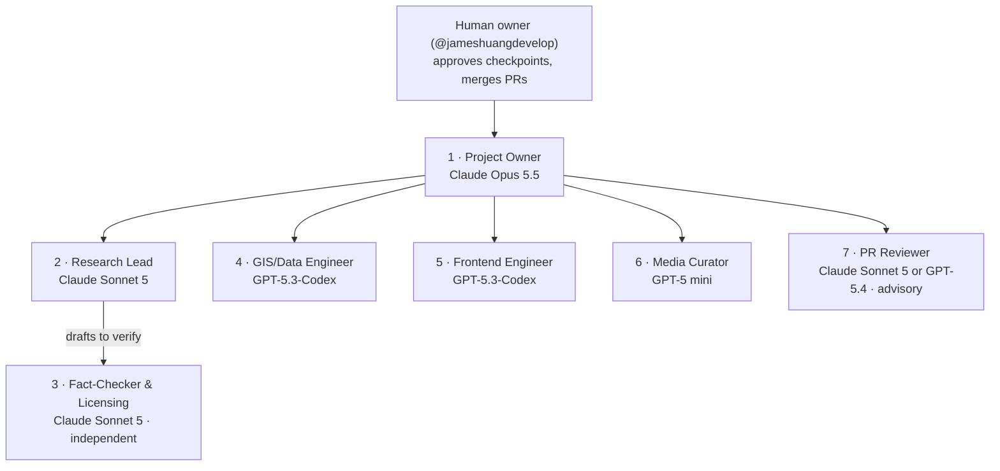

# Checkpoints

Each checkpoint is a PR labeled `checkpoint`. Its description gives a summary, the decisions needed, and the budget used. **All agents pause at a checkpoint until @jameshuangdevelop merges the PR or comments "approved".**

| CP | Milestone | Deliverable | Status | PR |
|---|---|---|---|---|
| CP0 | M0 Setup & Plan | Plan, org chart, budget forecast | Approved 2026-09-23 | #2 |
| CP1 | M1 Research & Options | Source inventory with licenses; stack options with pricing; human picks the stack; ADRs recorded | Approved 2026-09-23 | #3–#7 |
| CP2 | M2 Schema & Core Data | Final schema and validation CI; 40 verified core sites; verification report | Approved 2026-09-24 | #8–#14 |
| CP3a | M3 MVP App | Low-fidelity visual spec and mockup | Approved 2026-09-28 | #15–#16 |
| CP3.5 | M3.5 Images | 5–10 images for each of 31 major places and 1–3 for the rest, cited AI reconstructions, link checks, and a larger gallery | Approved 2026-10-02 | #29–#37 |
| CP3b | M3 MVP App | Working MVP deployed to a preview | **In progress** (M3-06 merged as #39; M3-14 to M3-16 and M3-18 to M3-24) | |
| CP4 | M4 Ancient Layer & Timeline | Modern↔Ancient toggle, ancient provinces and roads, timeline that snaps to change years | Not started | |
| CP5 | M5 Routes Tab | Paul's journeys and well-attested Jesus segments, with citations | Not started | |
| CP6+ | M6 Expansion | About 50 verified locations per batch, one checkpoint per batch, up to about 300 | Not started | |
| CP7 | M7 Mobile-web polish | Responsive layout, touch gestures, performance | Not started | |

### Mini checkpoints (ADR-0031)
Lighter stops between checkpoints: the PO opens the app with the work so far on a local server, and you try it and give feedback. There's no PR and no approval; only the step listed under "Waits for your feedback" is held.

| MC | On the way to | What you can try | Waits for your feedback | Status |
|---|---|---|---|---|
| MC0 | CP3b | Today's app (main), as a baseline for the changes below | Nothing | Done 2026-10-05: photo credits at the end and a pointer over pins (ADR-0032, M3-19); a hosted site to share (M3-06) |
| MC1 | CP3b | Countries on the "Today" line and in search results, the chip moved onto that line, no action bar (M3-14's data with M3-15), and galleries of 4 to 7 images (M3-18) | The reviews of M3-14, M3-15 and M3-18 | Done 2026-10-05: Salamis as "Cyprus" approved |
| MC2 | CP3b | The longer "About" for the first 13 places (M3-16 half 1), and photo credits at the end of the panel with a pointer over pins (M3-19) | The second half's writing, and M3-19's review | Done 2026-10-05: About approved; introduce names, places in the About, collapsible sections (ADR-0033, M3-20 to M3-22) |
| MC3 | CP3b | Everything merged and built as it will deploy, with the accessibility and speed results (M3-06, M3-14 to M3-16 and M3-18 to M3-22) | The push | Done 2026-10-06: Philadelphia quotes Revelation 3:9 the way Smyrna quotes 2:9 (option B); the candidate-site notes stay as they are; important places first on the opening map (ADR-0035, M3-23). The human approved the push once M3-23 is done. |
| MC4 | CP3b | Important places first on the opening map (M3-23), on the full stack | Nothing (the push is approved) | Done 2026-10-07: opened on a local preview; the human had already approved the push |

---

## CP0 — Setup & Plan

### Org chart

```mermaid
flowchart TD
  H["Human owner (@jameshuangdevelop)<br/>approves checkpoints, merges PRs"]
  PO["1 · Project Owner<br/>Claude Opus 5.5"]
  RL["2 · Research Lead<br/>Claude Sonnet 5"]
  FC["3 · Fact-Checker & Licensing<br/>Claude Sonnet 5 · independent"]
  GIS["4 · GIS/Data Engineer<br/>GPT-5.3-Codex"]
  FE["5 · Frontend Engineer<br/>GPT-5.3-Codex"]
  MC["6 · Media Curator<br/>GPT-5 mini"]
  PR["7 · PR Reviewer<br/>Claude Sonnet 5 or GPT-5.4 · advisory"]
  H --> PO
  PO --> RL & GIS & FE & MC & PR
  RL -->|drafts to verify| FC
```
Agent definitions are in `.github/agents/`. Model choices and fallbacks are in ADR-0003, and the reviewer's vendor rule is in ADR-0004 ([DECISIONS.md](docs/DECISIONS.md)).

### Plan
**How work flows.** The PO writes a task card. The human opens a new Copilot Chat, picks the agent and model on the card, and pastes it. The agent works on its own branch, commits, and prints the push and PR commands. The human runs `pr-reviewer` on the PR and merges. Cards for a milestone are written when it starts, so each one builds on the latest results. When the human asks the PO to drive from Copilot CLI, the PO runs the cards as subagents instead (ADR-0007).

**M1 — Research & Options** (the first two cards are ready)

| ID | Task | Agent | Branch | Starts after |
|---|---|---|---|---|
| [M1-01](docs/tasks/M1-01-source-inventory.md) | Source inventory with licenses | research-lead | `docs/m1-source-inventory` | CP0 (runs in parallel with M1-02) |
| [M1-02](docs/tasks/M1-02-stack-options.md) | Stack and hosting options with pricing, plus learning resources | gis-engineer | `docs/m1-stack-options` | CP0 (runs in parallel with M1-01) |
| M1-03 | License verification of the inventory; first `docs/LICENSES.md` decisions | fact-checker | `docs/m1-license-review` | M1-01 merged |
| M1-04 | CP1 summary; ADRs for the stack the human picks | project-owner | `docs/cp1-summary` | M1-01 to M1-03 merged |

**Later milestones** (outline; `→` means "then", `‖` means "in parallel")
- **M2:** schema and validation CI (GIS) → 40 core sites in 2 batches (Research) ‖ images for each batch (Media) → verification (Fact-Checker) → CP2.
- **M3:** visual spec (PO) → CP3a → app scaffold and CI (Frontend) → map, pins and zoom tiers → details panel → candidate sites and search → preview deploy → CP3b.
- **M4:** timeline events (Research) ‖ ancient layers (GIS) → verification → toggle and timeline UI (Frontend) → CP4.
- **M5:** route segments (Research) → verification → routes tab (Frontend) → CP5.
- **M6:** batches of about 50 (Research → Media → Fact-Checker), one checkpoint each.
- **M7:** responsive layout, touch and performance (Frontend) → CP7.

### Budget forecast
About **27,000 AI credits for the whole project** (range 15k–55k, roughly US$150–550), which is under 3% of the 1,000,000-credit monthly cap. Budget does not set the pace; review time at each checkpoint does. A 1,500-credit session guard catches runaway sessions. Details and model rates: [docs/BUDGET.md](docs/BUDGET.md).

### Risks
- **Data licenses.** Some candidate sources may carry share-alike terms that decide the data license. M1-03 settles this before any data is written.
- **Merge conflicts** on `docs/PROGRESS.md` and `docs/BUDGET.md` from parallel branches. Mitigation: each task edits only its own row (ADR-0006).
- **Model availability.** Plans or policies can block a model. The agent files list fallbacks, and the PO records any substitution.
- **Checkpoint wait time.** Every agent pauses at each checkpoint, so review speed sets the schedule.

### Decisions needed from you
1. **Approve the plan and org chart.** Merge the PR or comment "approved".
2. **Models:** confirm that the models in ADR-0003 are enabled for your account, and tell the PO about any that are blocked.
3. **Create the `checkpoint` label.** The command is in the PR description.
4. *Optional:* protect `main` (require a PR and block force pushes) so the "never push to `main`" rule is enforced. Recommended.
5. *Optional:* with this much budget headroom, the Fact-Checker could use Claude Opus 5.5 instead of Sonnet 5 for stronger verification, at about 2k extra credits over the project. **PO recommendation:** stay on Sonnet 5 for now, following the brief's "cheapest model that does the task well" rule, and revisit at CP2 after the first verification report.

---

## CP1 — Research & Options

**Outcome:** approved as recommended on 2026-09-23 (#7). ADR-0008 to ADR-0011 and ADR-0013 are Accepted.

### What was delivered
| Task | Output | Branch (merge in this order) |
|---|---|---|
| M1-00 | CP0 recorded; ADR-0007 (the PO drives from Copilot CLI) | `docs/m1-kickoff` |
| M1-01 | [Source inventory](docs/research/SOURCES.md): 12 sources, licenses read at each source, and a 10-place ID spot-check | `docs/m1-source-inventory` |
| M1-02 | [Stack options](docs/research/STACK_OPTIONS.md) with pricing, and a [learning list](docs/research/LEARNING.md) | `docs/m1-stack-options` |
| M1-03 | [License review](docs/verification/M1.md): content licenses decided in [LICENSES.md](docs/LICENSES.md) and [ATTRIBUTION.md](ATTRIBUTION.md) | `docs/m1-license-review` |
| M1-04 | This summary, and the proposed stack ADRs | `docs/cp1-summary` |

Each branch, M1-00 to M1-04, was reviewed by the PR Reviewer from a different vendor than its author (ADR-0004). Every must-consider finding was fixed in a follow-up commit on that branch before the PRs were opened.

### Decisions needed from you
**Merging this PR accepts every recommendation below.** To choose differently, comment on the PR, and the PO will update the ADRs before you merge.

| # | Decision | Recommendation | Runner-up | Monthly cost at 1k / 50k visits | ADR |
|---|---|---|---|---|---|
| 1 | Map library | **MapLibre**: `react-map-gl/maplibre` on web, `@maplibre/maplibre-react-native` for native later | Mapbox | $0 / $0 | ADR-0008 |
| 2 | Modern basemap | **OpenFreeMap**, with contested borders hidden using the `disputed` flag. It has no uptime guarantee, so a fallback style must be wired in before launch. | Protomaps PMTiles self-hosted on Cloudflare R2 | $0 / $0 (Mapbox tiles would cost about $650 at 50k) | ADR-0009 |
| 3 | Ancient mode | **Our own GeoJSON overlays** (provinces for each timeline year, roads, coastlines) on a neutral base | Our own PMTiles archive, if the data grows | $0 / $0 | ADR-0009 |
| 4 | Hosting | **Cloudflare Pages**, with preview deploys from GitHub Actions | Vercel ($20 at 50k) | $0 / $0 | ADR-0010 |
| 5 | Backend | **None for the MVP**: static JSON files and client-side search | Cloudflare Workers + D1 | $0 / $0 | ADR-0011 |
| 6 | WEB edition | **`engwebp`** (US spelling). Both options are public domain, 66-book, and use "LORD". | `engwebpb` (British spelling) | — | ADR-0013 |

**For your information (already decided by the Fact-Checker; brief §2.4):** code is MIT, geometry derived from OpenStreetMap or AWMC in `data/geo/` is ODbL 1.0, all other data and content is CC BY-SA 4.0, and WEB text stays public domain (ADR-0012).

**What you'll need to do later (in M3, not now):** create a free Cloudflare account and add a Pages deploy token to the repository's GitHub secrets, so CI can publish preview deploys. The M3 card will give the exact steps.

### Concepts for you
- **Vector tiles and a style.** The map is drawn in your browser from small data tiles, following a style file. Changing the style (for example hiding contested borders) needs no new data. [MapLibre docs](https://maplibre.org/maplibre-gl-js/docs/)
- **GeoJSON overlay.** Our own shapes (provinces, roads) are drawn on top of the basemap from plain JSON files. [RFC 7946](https://datatracker.ietf.org/doc/html/rfc7946)
- **Share-alike.** Anyone who reuses our data must release their version under the same license. This is why the data is CC BY-SA 4.0 and the OSM-derived geometry is ODbL. [CC BY-SA 4.0](https://creativecommons.org/licenses/by-sa/4.0/)
- The full learning list is in [LEARNING.md](docs/research/LEARNING.md).

### Risks
- **OpenFreeMap has no SLA.** Mitigation: the M3 card requires tile-error monitoring and a config-switchable fallback style before launch.
- **Share-alike data.** Every data PR must record its source so that ODbL-derived fields never leak into CC BY-SA records (LICENSES.md rule). The Fact-Checker checks this in M2.
- **Stacked PRs.** These must be merged in the order shown above, or a later PR will pull in earlier commits.

### Budget
M1 used about **2,800 AI credits** (forecast ~2,200; the review-and-fix rounds were the extra cost), and the month total is about **3,300 of 1,000,000 (0.3%)**. See [BUDGET.md](docs/BUDGET.md).

### Next (after you approve)
The PO writes the M2 cards. First the schema and validation CI (GIS Engineer), then the 40 core sites in 2 batches (Research Lead, then Media Curator and Fact-Checker), and then CP2.

---

## CP2 — Schema & Core Data

**Outcome:** approved as recommended on 2026-09-24 (#14). ADR-0018 and ADR-0021 are Accepted.

### What was delivered
| Task | Output | PR / branch (merge in this order) |
|---|---|---|
| M2-00 | CP1 recorded, the M2 cards, ADR-0014 and ADR-0015 | #8 (merged) |
| M2-01 | Location, media and bibliography schemas; a validator and CI; the WEB `engwebp` text snapshot | #9 (merged) |
| M2-02 | Batch 1: Jerusalem, Judea and Galilee, 20 sites and 2 regions ([verification](docs/verification/M2-batch-1.md)) | #10 (merged) |
| M2-03 | Batch 2: Samaria, Acts and the Pauline cities, 20 sites and 1 region ([verification](docs/verification/M2-batch-2.md)) | #11 (merged) |
| M2-06 | Stable image IDs (`<location-id>-NN`) and a review of every lead image, answering your question on #11 | `feat/m2-image-ids` |
| M2-05 | Batch 3: Paul's letters, Revelation's churches and Acts, 20 places ([verification](docs/verification/M2-batch-3.md)) | `data/m2-batch-3` |
| M2-04 | This summary, ADR-0016 to ADR-0021, and agent-file updates | `docs/cp2-summary` |

**The dataset:** 63 records, **all verified by the Fact-Checker**: 57 sites and 6 area records (Judea, Galilee, Samaria, Galatia, Crete and the island of Malta).
- **Images:** 131 freely licensed images, hotlinked from Wikimedia Commons and never committed. Each has a stable id.
- **Scripture:** 677 New Testament references, whose WEB text the validator checks.
- **Sources:** 31 bibliography entries.
- **Split:** 22 Gospel sites and 35 Acts and Epistles sites.
- **Coverage:** every destination of Paul's letters (Rome, Corinth, Galatia, Ephesus, Philippi, Colossae, Thessalonica and Crete), the other places the letters name (Cenchreae, Laodicea, Hierapolis, Nicopolis, Troas and Miletus), all seven churches of Revelation plus Patmos, and the main stops of Paul's journeys in Acts.
- **Disputed places:** seven show several mapped candidates: Golgotha, Emmaus, Bethany beyond the Jordan, Bethsaida, Cana, Derbe and Malta (Melita). Sychar is also disputed, but its second candidate, Askar, is described only in text (decision 3). Jericho has two points for two periods; it is not disputed.

### How quality was checked
- **One branch per batch:** the Research Lead drafted it, the Media Curator added images, and the Fact-Checker verified it. A PR Reviewer from a different vendor then audited samples (ADR-0004, ADR-0014).
- **Claims:** the reviewers caught text that its sources did not state, such as Corinth as "capital of Achaia". Since then, every factual clause must be stated by a cited source: dataset IDs for locations, `bib:` entries for history, and `scripture:` for what a passage reports (ADR-0017).
- **Images:** the lighter models chose wrong or irrelevant images. Examples include Berea, Ohio; Na'in, Iran; a dessert as Thessalonica's lead photo; and postage stamps for Smyrna.
  - The M2-06 review fixed 10 lead images in batches 1–2.
  - Batch 3's first image pass was rejected and redone on Claude Sonnet 5, starting from each place's Wikidata main image (ADR-0020).
- **Stronger Fact-Checker:** batch 3's Fact-Checker ran on Claude Opus 5.5 (decision 6, applied early). It found 30 issues in its first round, mostly coordinates credited to the wrong dataset, then 5, then 1. Batch 3's reviewer then found no data problems.

### Decisions needed from you
**Merging this PR approves CP2 with the recommendations below.** To choose differently, comment on the PR.

| # | Decision | Recommendation | Alternative |
|---|---|---|---|
| 1 | The batch 3 list (the Acts and Epistles rebalance, ADR-0018) | Keep it as delivered. The reviewer suggests Assos, Sidon and Myra for a later batch. | Add or drop places |
| 2 | Temple Mount scripture | Keep a representative set of 7 passages set at the Temple, as the record states | List every New Testament mention of the Temple (100+) |
| 3 | Candidate sites without a usable coordinate | Accept a text-only mention for now (Sychar: Askar has no licensable coordinate), and add an "unmapped candidate" field to the schema before M6 | Hold Sychar back until it can be mapped |
| 4 | Lystra has no image | Accept this for now. No freely licensed photo of the site exists, and Wikidata confuses it with nearby Kilistra. Revisit in M6, or use a labeled AI reconstruction later. | Show a painting, which breaks the "shows the place" rule |
| 5 | Political history | Fill it in consistently in M4 from the timeline events. Batch 1 has it; batches 2–3 have little. | Fill it in now |
| 6 | Fact-Checker model (ADR-0021) | Claude Opus 5.5 from now on: about 1.7× the cost per session, but fewer rounds | Go back to Claude Sonnet 5 |

**For your information:**
- **ADR-0019:** you let the PO reply to GitHub comments directly in this repository.
- **ADR-0020:** the Media Curator now runs on Claude Sonnet 5.

### Concepts for you
- **Kinds of citation.** Dataset IDs (Pleiades, Wikidata, DARE, OpenBible) establish *where* a place is. `bib:` entries point to scholarly works and authorities for historical claims. `scripture:` points to the passage that reports an event.
- **Stable image id.** Our own name for a Commons image, for example `corinth-01`, where `-01` is the lead photo. The file itself stays on Commons under its Commons name.
- **Disputed site.** A place with several proposed locations. The map shows every candidate that has a usable coordinate, each with its own confidence level. [Pleiades on uncertainty](https://pleiades.stoa.org/help/conceptual-overview)
- **License port.** A country-specific version of a Creative Commons license, for example CC BY-SA 2.0 de, with the same terms. We record the exact name. [Creative Commons FAQ](https://creativecommons.org/faq/)

### Risks
- **Upstream data errors.** Wikidata and Pleiades entries can be wrong or change; Wikidata's Lystra item describes Kilistra. Each coordinate records its source and is checked against a second source, so drift can be detected later.
- **Verification cost.** M2 needed more rounds than forecast. Stronger models from the start (ADR-0020, ADR-0021) made batch 3 cheaper than batches 1–2.

### Budget
M2 used about **22,700 AI credits** against a forecast of about 4,000. Counting each batch's agent and review sessions but not the PO's coordination, batches 1, 2 and 3 cost about 5,100, 6,700 and 3,500 credits. The month total is about **25,900 of 1,000,000 (2.6%)**. See [BUDGET.md](docs/BUDGET.md).

### Next (after you approve)
M3, the MVP app.
- The PO writes a low-fidelity visual spec (CP3a).
- The Frontend Engineer scaffolds Expo with React Native Web and MapLibre, and builds the map, pins, zoom tiers, details panel, candidate sites and search, with a Cloudflare Pages preview (CP3b).
- At that point you'll need a free Cloudflare account and a deploy token; the M3 card will give the steps.

---

## CP3a — Visual spec

**Outcome:** approved on 2026-09-28 (#16). Decision 1 is Liberty (ADR-0022), and decisions 2–5 are as recommended. The build (M3-02 to M3-08) has started.

### What was delivered
- **[Visual spec](docs/design/VISUAL_SPEC.md):** layout, map, place panel, search, states, visual tokens, accessibility (WCAG 2.2 AA), neutrality rules, attribution, links and performance targets. The model is Google Maps on desktop, with the colourful OpenFreeMap Liberty basemap (decision 1).
- **[Five low-fidelity wireframes](docs/design/wireframes/):** the map overview, a place panel (Capernaum), a disputed place (Emmaus, with four lettered candidates), search ("Antioch"), and the small screen. Every name, count and quotation in them comes from the real data and the WEB. The wireframes draw the map schematically on purpose, to show layout.
- **[Basemap previews](docs/design/VISUAL_SPEC.md#basemap-options-what-positron-and-liberty-look-like-cp3a-decision-1):** real renders of Positron and Liberty at three zoom levels, with all 63 places drawn on them. They show the intended look of the finished map's basemap and pins.
- **The M3 build cards** (plan below). They are ready to dispatch as soon as you approve.

### The M3 plan
| ID | Task | Agent | Starts after |
|---|---|---|---|
| [M3-02](docs/tasks/M3-02-app-scaffold.md) | App scaffold, data build and CI | frontend-engineer | CP3a (in parallel with M3-07 and M3-08) |
| [M3-07](docs/tasks/M3-07-basemap-attribution.md) | Basemap attribution, style license and fallback-provider licenses | fact-checker | CP3a |
| [M3-08](docs/tasks/M3-08-modern-names.md) | Neutral modern names (decision 3) | gis-engineer → research-lead → fact-checker | CP3a |
| [M3-03](docs/tasks/M3-03-map-view.md) | Map view: basemap, pins, tiers, clustering, disputed candidates | frontend-engineer | M3-02 |
| [M3-04](docs/tasks/M3-04-place-panel.md) | Place panel | frontend-engineer | M3-03 (in parallel with M3-05) |
| [M3-05](docs/tasks/M3-05-search.md) | Search by place name, and the menu | frontend-engineer | M3-03 |
| [M3-06](docs/tasks/M3-06-preview-deploy.md) | Preview deploy, accessibility and performance checks | frontend-engineer | M3-04, M3-05 and your Cloudflare secrets |
| CP3b | Working MVP deployed to a preview | project-owner | M3-06 |

### Decisions needed from you
**Decision 1 is already decided (Liberty). Merging this PR approves decisions 2–5 as recommended.** To choose differently, comment on the PR, and I'll update the spec before the build starts.

| # | Decision | Recommendation | Alternative |
|---|---|---|---|
| 1 | Basemap look ([see both](docs/design/VISUAL_SPEC.md#basemap-options-what-positron-and-liberty-look-like-cp3a-decision-1)) | **Decided: OpenFreeMap Liberty**, which is colourful and closer to Google Maps. This was your choice on 2026-09-28, after comparing the renders (ADR-0022). The natural-feature pin was darkened so that every pin keeps at least 3:1 contrast on it. | OpenFreeMap Positron, muted grey (the PO's original recommendation) |
| 2 | Place title | The ancient name first (**Capernaum**), with the modern name underneath | The modern name first |
| 3 | Modern names | The place name only: no country, state or political descriptor, and none for disputed places. Today's data mixes these ("Yalvaç (Turkey)", "Tell Balata (Nablus, West Bank)"), so M3-08 cleans it up. | Keep countries where the border is undisputed |
| 4 | Scripture list | The first 5 passages, then "Show all *n*" (Jerusalem has 174) | Always show every passage |
| 5 | Disputed places when zoomed out | One pin with a "?" badge until zoom 8, then one lettered pin per candidate | Always show every candidate |

### Your action before CP3b — secrets added (2026-09-25)
The preview deploy needs a Cloudflare API token that can only deploy Pages, plus the account ID, stored as the repository secrets `CLOUDFLARE_API_TOKEN` and `CLOUDFLARE_ACCOUNT_ID`. Both were added on 2026-09-25, and `gh secret list` confirms their names. The first preview deploy in M3-06 will confirm that the token works.

Cloudflare's token screen had changed, so the token was created through the Cloudflare API with [`scripts/setup-cloudflare-token.ps1`](scripts/setup-cloudflare-token.ps1). The script is run by the human, never by an agent, and never prints a token:
1. In the Cloudflare dashboard (**Manage Account → Account API Tokens**), create a temporary bootstrap token for this account with the single permission policy **Create account tokens** (the API calls it *Account API Tokens Write*), expiring the next day. Restrict it to your current IP address if that is practical.
2. Run `pwsh -File scripts/setup-cloudflare-token.ps1` and enter the account ID (the 32-character id in the dashboard URL) and the bootstrap token (input hidden).
3. The script creates a token limited to **Pages Write** that is valid for one year, stores both secrets with the GitHub CLI, and offers to delete the bootstrap token.

**Renewal:** the token expires on about 2027-09-25. Run the same script again before then. Sources: [Create Token](https://developers.cloudflare.com/api/resources/accounts/subresources/tokens/methods/create/) and [Account API tokens](https://developers.cloudflare.com/fundamentals/api/get-started/account-owned-tokens/) (read 2026-09-25).

### Concepts for you
- **Style file.** A JSON file that tells the map how to draw the tiles: colours, which labels to show, which layers to hide. We host our own customized copy of Liberty, so we can hide disputed borders, show English labels and remove points of interest. [MapLibre style spec](https://maplibre.org/maplibre-style-spec/)
- **Zoom level.** Web maps use levels from about 0 (the whole world) to 20 (a building). Our tiers map onto them: regions at 4–9, cities from 4, and sites within a city from 12.
- **Clustering.** When pins are too close together at a low zoom, they merge into a bubble with a count, which splits apart as you zoom in.

### Budget
The spec and cards cost about 900 AI credits. M3 is forecast at about 7,000–9,000 credits: five Frontend Engineer sessions, M3-07 and M3-08, and their reviews. The month total is about 27,100 of 1,000,000 (2.7%). See [BUDGET.md](docs/BUDGET.md).

---

## CP3.5 — Images

**Outcome:** approved as recommended on 2026-10-02 (#37). Decision 1 confirms the disputed-territory defaults of ADR-0028. Under decision 2, the preview deploy (M3-06) runs alongside M3-14 and M3-16.

### What was delivered
| Task | Output | PR |
|---|---|---|
| M3.5-00 | The plan from your review on 2026-09-30: ADR-0028 to ADR-0030 and cards M3.5-01 to M3.5-07 | #29 |
| M3.5-01 | `prominence` and image `kind` in the schema; the five broken links fixed (Rome's three among them); `check:images`, which loads every image at the sizes the app uses, on every media change and weekly | #30 |
| M3.5-06 | A larger gallery: a bigger viewer, a label for each kind of image, a row of thumbnails, sharp crops for wide and tall photos, keyboard use, and photos that load only when needed | #31 |
| M3.5-02 to M3.5-04 | 31 cited research briefs, and photos for the major places in three batches: Jerusalem and the Gospels (13, [verification](docs/verification/M3.5-images-a.md)), Paul's letters and the capitals (12, [verification](docs/verification/M3.5-images-b.md)), and Revelation's churches (6, [verification](docs/verification/M3.5-images-c.md)) | #35, #32, #33 |
| M3.5-05 | A pass over the 31 standard places with images: weak or duplicate photos replaced, region maps swapped for landscapes ([verification](docs/verification/M3.5-images-standard.md)) | #34 |
| M3.5-07 | 31 AI reconstructions, one per major place, which you approved on 2026-10-02 ([checks](docs/verification/M3.5-ai-images.md)) | #36 |

**The images now:** 275, up from 131 at CP2.
- **Major places (31):** 6 to 8 images each, 213 in all. Each gallery opens with the AI reconstruction, so a reader's first impression is the place as it looked in Bible times, and then shows the place today and its excavated remains.
- **Standard places (31):** 1 to 3 images each, 62 in all.
- **By kind:** 121 excavated site, 107 today, 31 AI reconstruction, 8 historical view (an old photo or engraving) and 8 reconstruction (a model or painting).
- **Without images:** Lystra (no freely licensed photo exists; CP2 decision 4) and the 26 area records (provinces, regions and empires), as M3.5-05 planned.
- **The "few stones" rule:** close-ups of fragments were replaced with wide views of each place in its landscape (ADR-0029 §5), Laodicea's among them.

### How quality was checked
- **One chain per batch:** the Research Lead wrote a cited brief for each place, the Media Curator chose photos and wrote prompts, and the Fact-Checker opened every source and checked every image's license, place, kind and caption. A reviewer from the other vendor then reviewed each PR.
- **Photos were viewed, not just searched.** The Media Curator's first runs, on a lighter model, chose junk: Bethlehem Steel, basketball videos and PDFs. They were redone on Claude Sonnet 5, viewing every thumbnail before accepting it.
- **Every link loads:** the validator checks each Commons address offline, and the link check loads each image at the app's sizes.
- **AI images, checked as the games do it:** each prompt was written from the place's brief and checked against it before generating. Free models dropped historical details (glazed windows, chimneys, a shrunken Temple), so you chose Google's Gemini (Nano Banana Pro). The Fact-Checker viewed every image at full size: 15 passed and 16 had errors, such as later church towers, radio masts, painted boats, or famous buildings drawn as today's ruins. Each was fixed with one edit of the same image. The PO's own check found 3 more, each fixed with one more edit. You approved the final set.

### Decisions needed from you
**Merging this PR approves CP3.5 with the recommendations below.** To choose differently, comment on the PR.

| # | Decision | Recommendation | Alternative |
|---|---|---|---|
| 1 | Countries for places in disputed territory (ADR-0028) | **The territory's common English name:** "West Bank" for Bethlehem, Jericho, Bethany (Al-Eizariya), Sychar (Tell Balata) and Qasr al-Yahud; "Golan Heights" for Banias and both Bethsaida sites; no country for Jerusalem and the places inside it. This says where a place is, not who should rule it. Unclear cases, such as Emmaus Nicopolis in the former Latrun no-man's land, come back to you. | Name a country for these too, and say which |
| 2 | The order of the rest of M3 | **Start the preview deploy (M3-06) now, alongside the countries (M3-14) and the longer "About" (M3-16);** the panel header (M3-15) follows M3-14's schema step. You can then try each change on a preview link on your own device, not over remote desktop. CP3b follows once all four have merged. | Deploy last, once the other three have merged |

**For your information:**
- **The seven churches of Revelation** are among the 31 major places (ADR-0029), as delivered.
- **AI images:** one per major place, as you asked. The briefs keep 40 more prompts for later. The 50 paid images (31, plus 19 edits) cost about US$3.49 of the US$20 you set aside.
- **Gethsemane** has no photo of excavated remains, because none is freely licensed; all its photos show the garden and church today.

### Concepts for you
- **Lazy loading.** A photo loads only when it is about to be seen, so a place with 8 images doesn't slow the map. [MDN: Lazy loading](https://developer.mozilla.org/en-US/docs/Web/Performance/Guides/Lazy_loading)
- **Rate limiting (HTTP 429).** Wikimedia refuses requests that come too fast. The link check spaces its requests. When several checks run at once, one can still fail, and rerunning it clears the failure. [MDN: 429 Too Many Requests](https://developer.mozilla.org/en-US/docs/Web/HTTP/Reference/Status/429)
- **WebP.** An image format smaller than JPEG at the same quality. Each AI image is a WebP of at most 1,600 px and 400 KB, hosted in the repository. [Google: WebP](https://developers.google.com/speed/webp)
- **SynthID.** An invisible watermark Google puts in every image its models make, so tools can tell that the image is AI-generated. We show our own label as well. [Google DeepMind: SynthID](https://deepmind.google/models/synthid/)

### Risks
- **Photos can change upstream.** Commons files can be renamed, deleted or relicensed. The weekly link check finds broken ones, and each image keeps its Commons page for re-checking.
- **AI reconstructions are informed guesses.** Each one shows its label, a "Based on" link to the cited brief, and the "Report an issue" link. The Fact-Checker checked each against its brief.
- **Repository size.** The AI images add 10.5 MB. At the limit of 3 per major place, they would add about 30 MB.

### Budget
M3.5 used about **64,850 AI credits**, under its cards' combined targets of about 82,000. About 7,100 of it fell in September. The Fact-Checker's image-batch verifications on Claude Opus 5.5 (5,000–7,000 each) were the largest items. September closed at about 75,500 credits (7.6%), and October stands at about **57,750 of 1,000,000 (5.8%)**. See [BUDGET.md](docs/BUDGET.md).
- These figures are the ledger's estimates. GitHub's billing report is the authority (ADR-0005), but the agents' GitHub token can't read it, so a look at your Copilot usage page would confirm them.
- The Gemini images are billed by Google, not in Copilot credits.

### Next (after you approve)
The rest of M3, then CP3b.

| ID | Task | Agent | Starts after |
|---|---|---|---|
| [M3-06](docs/tasks/M3-06-preview-deploy.md) | Preview deploy, accessibility and performance checks | frontend-engineer | CP3.5 |
| [M3-14](docs/tasks/M3-14-modern-countries.md) | Countries in modern names (ADR-0028, decision 1) | gis-engineer → research-lead → fact-checker | CP3.5 |
| [M3-15](docs/tasks/M3-15-panel-header.md) | A simpler panel header, with countries (ADR-0028, ADR-0030) | frontend-engineer | M3-14's schema commit |
| [M3-16](docs/tasks/M3-16-longer-about.md) | A longer "About" for the 31 major places: 250–450 cited words each, up from a median of 75 | research-lead → fact-checker | CP3.5 |
| CP3b | Working MVP deployed to a preview | project-owner | M3-06 and M3-14 to M3-16 merged |
