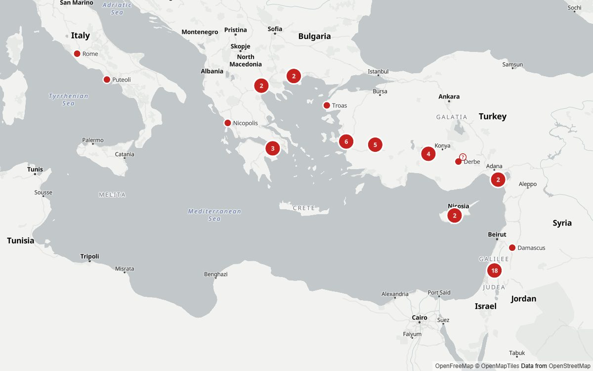
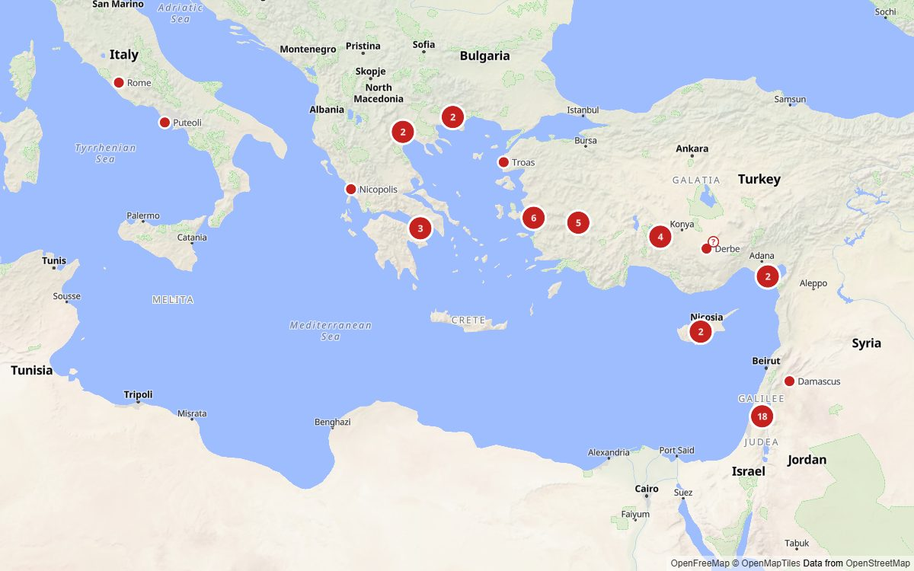
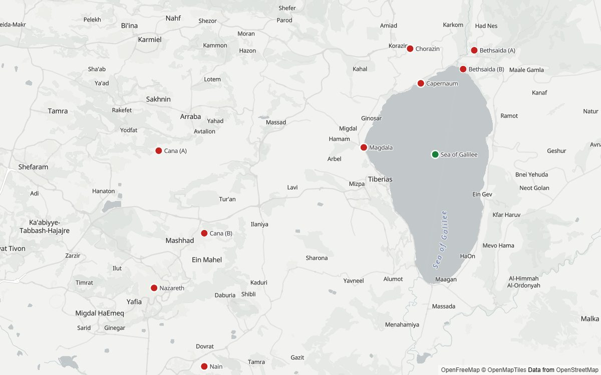
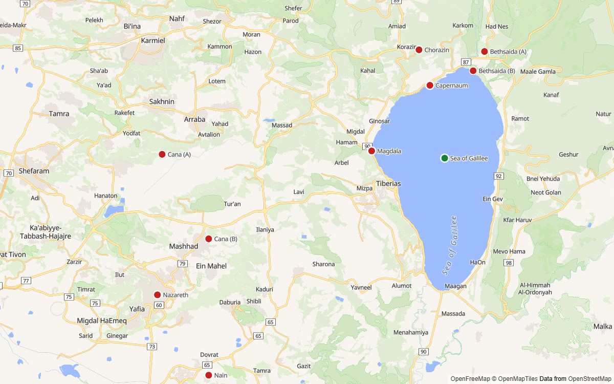
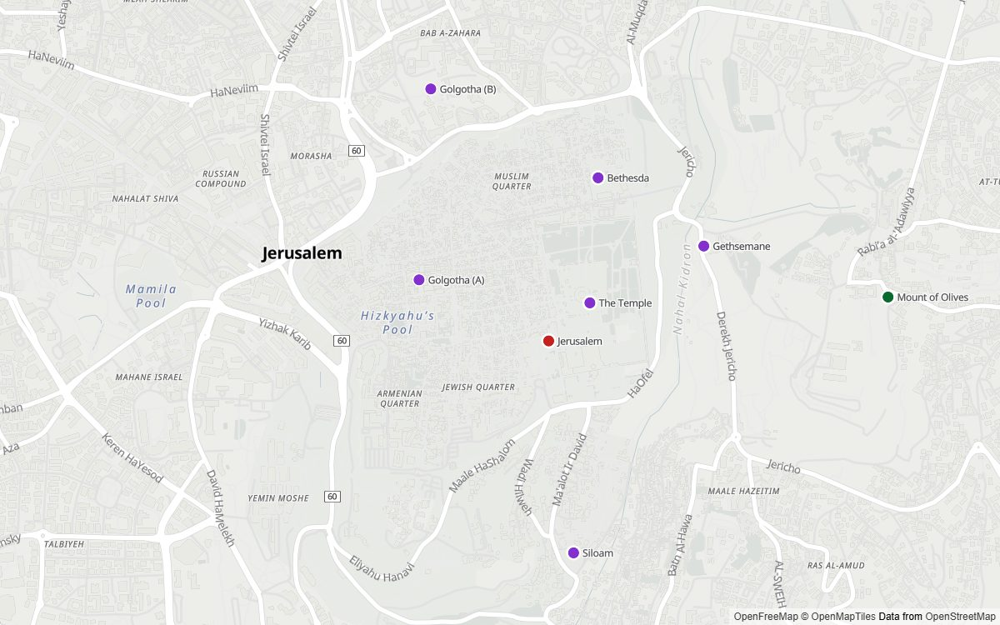
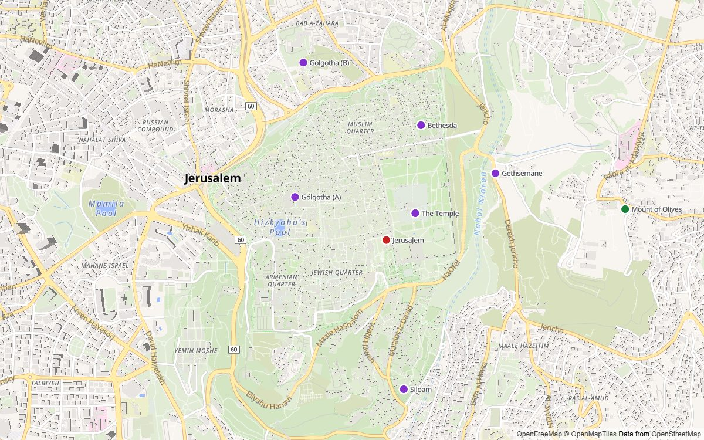

# Visual spec — the map app (M3 and M4, low fidelity)

This spec describes how the map app looks and behaves. It is low fidelity on purpose: it fixes layout, content order, interaction and accessibility, and leaves exact pixels to the build. The wireframes are in [wireframes/](wireframes/); they show the M3 app. The Frontend Engineer builds against this document (M3's tasks, and from M4 the toggle, the ancient layer and the timeline), and the PO updates it when a decision changes.

**Model:** Google Maps on desktop: a full-screen map, a floating search box, and a place panel on the left. The basemap is colourful and familiar, like Google Maps (OpenFreeMap Liberty, chosen at CP3a; ADR-0022). The biblical places stay clearly visible on it, and the tone of the text stays calm and scholarly.

## 1. Layout

### Desktop (width 1024 px and up)
| Area | Contents | Built in |
|---|---|---|
| Whole screen | The map | M3 |
| Top left, floating | Search box (about 400 × 48 px, pill-shaped) with a menu button on its left | M3 |
| Left side, full height | Place panel (about 408 px wide). It opens when a place is selected, and the search box floats on top of it. | M3 |
| Bottom right | Zoom in, zoom out and reset view, then the map attribution (compact "ⓘ") | M3 |
| Bottom left | Scale bar (metric) | M3 |
| Top centre | "Map" and "Routes" tabs | Reserved for M5 |
| Top right | The "Ancient" and "Modern" toggle, with the map key button below it (§2 "Ancient layer") | M4 |
| Bottom centre | The timeline (4 BC – AD 100, snapping to the years the map changes), on the ancient map only (§2 "Timeline") | M4 |

The Routes tabs are **not built yet**. The wireframes show the reserved areas with dashed outlines.

### Small screens (under 768 px) — basic only in M3
- The search box spans the width at the top, with 16 px margins.
- The place panel becomes a **bottom sheet**: it opens at about 40% height (photo and title), and is dragged or tapped to open fully. A close button sits at the top right.
- The zoom buttons are hidden, since pinch zoom replaces them; reset view stays.
- **The opening view fits the screen** (M7-01): the same area as on desktop, from Rome to Damascus and down to the Nile delta, is fitted to the screen's width, so a phone sees all of it at a lower zoom instead of only Greece.
- **Toggle and timeline (M4):** the toggle sits at the top right, just below the search box. The timeline spans the bottom with 16 px margins while no place is open; the bottom sheet covers it while a place is open, and it returns when the sheet closes.
- Full responsive polish is M7.

## 2. The map

### Basemap
- **The ancient map (the default; ADR-0024): a physical basemap.** The ancient map is in English and shows the ancient world only. Its basemap is derived from OpenFreeMap **Liberty** (ADR-0022) and **hosted by the app** (OpenFreeMap requires hosting a customized style yourself). It keeps only:
  - the background, the relief shading (`ne2_shaded`), natural landcover (wood, grass, scrub, sand, rock, ice, wetland), water, and rivers and streams.

  It has **no text labels, roads, railways, borders, towns, farmland, parks, buildings or points of interest**, so no modern name or border appears. The only labels on the ancient map are our own records, in English: places, regions, provinces and empires (§2 "Places on the map"), and from M4 the ancient layer's areas (§2 "Ancient layer"). Today's map is the other side of the toggle (§2 "Modern map").
- **Zoom:** from 3 (the whole Mediterranean) to **14** (neighbourhood level), where Jerusalem's sites are still clearly apart and a physical map has nothing more to show.
- **Fallback:** a basemap from a **different provider or host**, so that it still works if OpenFreeMap itself is down (ADR-0009). M3-03 uses the VersaTiles public server with our own copy of its Colorful style, given the same physical treatment. The app switches to it automatically after repeated tile errors, and configuration can also switch it. OpenFreeMap's Bright and Liberty styles use the same servers, so they are theme alternatives, not fallbacks.
- **Considered at CP3a:** OpenFreeMap Positron, a muted grey style, was the PO's recommendation. The human chose Liberty after comparing the renders below, then asked for an ancient-only map after the first build (ADR-0024).

### Basemap options: what Positron and Liberty look like (CP3a decision 1)
**Decided:** Liberty, on 2026-09-28 (ADR-0022). The comparison is kept as the record of the choice. **Since then,** the app draws a physical version of Liberty, without labels, roads, borders or towns (ADR-0024), so the finished map looks plainer than these renders.

These are real renders, not wireframes. They are what the app's map will look like, drawn with MapLibre 6.10 from OpenFreeMap tiles, with all 63 of our places in the pin colours from this spec.
- **Customizations the app will make:** English labels where the map data has them, no points of interest, clustering below zoom 7, a "?" badge on disputed places (for example Emmaus) when zoomed out, and lettered candidates for any place with several candidates when zoomed in.
- **Borders:** hidden in these previews, so that no contested line is shown here. The app hides only disputed boundaries.
- **Attribution:** each image carries the OpenFreeMap, OpenMapTiles and OpenStreetMap attribution in its corner.

| View | Positron: muted greys | **Liberty (chosen):** colourful, closer to Google Maps |
|---|---|---|
| Mediterranean overview (zoom 4.7) |  |  |
| Galilee (zoom 10.4) |  |  |
| Jerusalem, sites within the city (zoom 14.6) |  |  |

- **Positron** draws land in light grey and water in grey-blue, with thin white roads and small grey labels. The red, purple and green pins are the strongest colours on the screen, even in dense Jerusalem.
- **Liberty** draws land in beige and water in blue, with yellow and orange roads, green parks and building outlines. It looks more like Google Maps and gives more modern context, but it competes with the pins, especially at city zoom.

### Places on the map
| Record | Shown as | Colour |
|---|---|---|
| City, town, village | Round pin with a white 2 px outline; label beside it | Deep red `#C5221F` |
| Site within a city (for example the Temple Mount) | Round pin | Purple `#8430CE` |
| Natural feature (for example the Sea of Galilee) | Round pin | Dark green `#0B6B2E` |
| Empire (`type: "empire"`, from M3-11; for example the Roman Empire) | **No pin:** a clickable label in spaced capitals, 15 px, `#5F6368` | — |
| Province (`type: "province"`, from M3-11; for example Achaia or Macedonia) | **No pin:** a clickable label in spaced capitals, 13 px, `#5F6368` | — |
| Region or island record (for example Galilee or Crete) | **No pin:** a clickable label in spaced capitals, 12 px, `#5F6368` | — |

- **Drawn by the map (ADR-0024):** pins, labels, clusters, badges and candidate letters are MapLibre layers, drawn on the graphics card in the same frame as the map, so they never lag behind a drag or zoom. Labels that would overlap are hidden automatically; a hidden label still appears in the hover tooltip. Label priority is: the selected place; then major places in importance order (including the major areas Galatia and Crete); then empires, provinces and regions; then other places. Map labels use the basemap's Noto Sans font.
- **Contrast on Liberty:** every pin colour has at least 3:1 contrast against every Liberty background, park, wood, grass, building and water colour; the lowest is red on water, at 3.1:1. The natural-feature green was darkened from `#188038` because that colour reached only 2.7:1 on water, where pins such as the Sea of Galilee sit. The white outline separates each pin from the map.
- **Selected place:** its pin grows by about 30% and gets a drop shadow; the other pins stay as they are.
- **Hover** (on desktop): a tooltip with the name and type, and a pointer cursor over any clickable pin, cluster, disputed "?" badge, candidate letter or area label. A grouped major pin shows all of its members in the tooltip (for example "Jerusalem, Bethlehem, Bethany, Jericho, Bethany beyond the Jordan"). Elsewhere, MapLibre keeps its own grab/grabbing cursors.
- **Hit area:** hover and click check a small box around the pointer (about 8 px each way) and choose the nearest feature in that box, so crowded pins are easier to hit.
- **Keyboard:** every place on the map can be reached by keyboard through the list of visible places (see §7).

### Zoom tiers
The data's `zoomTier` decides when a place appears. The initial view shows the whole Mediterranean, from Rome to Damascus and down to the Nile delta.

| `zoomTier` | Visible from zoom | Notes |
|---|---|---|
| `region` | 6 to 9 | Labels only; they fade out as you zoom in. Within this tier, empire labels show from zoom 3 to 5, and province labels from 4 to 8. |
| `city` | 4 | **Major pins** (cities, towns, villages, plus city-tier sites and natural features) stay as their own dots below zoom 7. Where major pins overlap, they group as one labelled pin such as "Jerusalem +4"; selecting it opens the top member. **Other pins** step back below zoom 6 as smaller muted dots with no labels, and nearby ones fold into muted count bubbles. From zoom 6 they look and cluster as before. |
| `site` | 12 | Sites inside a city (Jerusalem's Temple Mount, pools and so on) appear only when zoomed in. |

**Selecting a place zooms the map to it:** a city to about zoom 11, a site to zoom 14 (the closest zoom), a region or province to about zoom 7, and an empire to about zoom 4. A place with several candidates zooms to fit all of them. If the user prefers reduced motion, the map jumps instead of flying.

### Places with several candidate sites
A place is **disputed** when at least one of its candidates has confidence `disputed` (see `schema/README.md`), for example Emmaus, Bethsaida and Cana. Other places also have several candidates without being disputed: Jericho's Old Testament tell and Herodian city, or Malta with a low-confidence minority proposal.
- **Below zoom 8:** one pin, placed at the first-listed candidate. **Disputed places add a "?" badge.**
- **From zoom 8, or when the place is selected:** one pin per candidate, lettered **A, B, C …** in the data's order, with a **dashed** white outline. Every candidate pin looks the same except for its letter; the map never marks one candidate as "the" site.
- Clicking any candidate opens the place, with that candidate highlighted in the panel.

### Ancient layer (M4)
On the ancient map only, drawn under the pins and labels, for the year the timeline shows (ADR-0037). The colours below are a starting point; the human tunes them at mini checkpoint MC7.
- **Areas:** each political area of that year is a shape. Kinds are told apart by fill, line and label text, never by colour alone:

  | Kind | Fill | Border |
  |---|---|---|
  | Roman province | Warm tint, `#B3261E` at 6% | Solid, `#7D5A50`, 1 px (1.5 px from zoom 7) |
  | Allied ("client") kingdom, tetrarchy, or free city or league under Rome | Ochre tint, `#E8A33D` at 12% | Dashed, `#7D5A50`, 1 px |
  | Outside the empire (for example the Parthian Empire, where a source gives its extent; none is drawn in M4, ADR-0037) | Grey tint, `#5F6368` at 6% | Solid, `#80868B`, 1 px |
  | Status unclear in the sources (for example Chalcis in AD 48–50) | No tint; thin diagonal hatching in `#80868B` | Dotted, `#80868B`, 1 px |
  | The Roman Empire's outer edge | — | Solid, `#7D5A50`, 2 px |

  Above zoom 10 the fills fade out; the borders stay. Roman lands far from our places, such as Africa or Moesia, form one area held by the Roman Empire, with no borders inside it (ADR-0037).
- **Area labels:** one label for each holder of that year (a province, kingdom, tetrarchy, free league, or a state outside the empire), at the centre of its largest piece, and of any other piece at least a third as large (for example the kingdom of Commagene, which also held part of Rough Cilicia from AD 41). The label stays on its piece: if it doesn't fit there, it's hidden rather than moved onto a neighbouring area. Labels are in spaced capitals like province labels (§2 "Places on the map"), from the timeline data's English names. A holder that is one of our records (for example Syria, Galatia, or Judea the province) adds no label of its own: the record's existing label shows, where it always has, and opens the record as now. A holder without a record (for example the tetrarchy of Philip) has a plain label, without the pointer cursor: hovering or focusing it shows a tooltip with its name, kind, ruler and years. The years are the span in which it held that area without a break, for example "4 BC – AD 34", or "from 27 BC" if it still held the area at the timeline's end. An area whose status is unclear has no label; hovering it shows "Status unclear in the sources" with the reason. A province record that holds no land in the selected year is hidden then; for example, the province of Judea in AD 41–44, when Agrippa I ruled it as king. Region labels (Galilee, Samaria and the others) stay as they are.
- **Roads:** major Roman roads (ADR-0037) as thin lines in `#8D6E63`, from 1 px at zoom 5 to 2 px at zoom 9; roads the data marks as known are solid, and conjectured ones dashed. They appear from zoom 5, under every label. No road names in M4. AWMC dates no road in the Holy Land, so none is drawn there; M5's routes show the journeys.
- **Ancient coastline,** only where it differs from today's (ADR-0037): the old shoreline is drawn as a dotted line in a darker tone of the water colour, so the land that silting has added since lies between it and today's coast.
- **Map key:** a small "Map key" button below the toggle opens a compact card: the four kinds of area, the empire's edge, known and conjectured roads, the ancient coastline, and "Borders are approximate. Provinces far from the New Testament's places are shown together, and lands whose borders aren't known, such as Abilene or Polemon's kingdom of Pontus, aren't drawn. Sources are under Sources & credits."
- **Smoothness:** the layer is drawn by MapLibre, like the pins (ADR-0024), so it moves with every drag and zoom.

### Timeline (M4)
- **Where:** bottom centre on the ancient map, up to about 800 px wide on desktop and never wider than the map area beside an open panel, less 16 px margins, on a white card with the panel's shadow. It is hidden on the modern map. The map's credit, when expanded, sits above the card and is never covered by it.
- **Track:** one tick per stop, evenly spaced rather than spaced by year, so that close years stay apart, each labelled with its year under its tick. To fit, only the first BC label and the first AD label name the era ("4 BC", "AD 6", "17", "34" and so on); the caption and the slider's spoken value always give the full year. When the track gives each stop less than about 36 px, as on phones, only the first and last ticks are labelled. The handle snaps to stops only. "Earlier" and "Later" buttons (‹ and ›, 44 × 44 px) sit at the ends.
- **Caption:** above the track, the stop's year and title on one line, for example "AD 44 · Agrippa I dies, and Judea is a Roman province again", then a "Sources" link. The link opens a small popover with the stop's one-paragraph summary, its Bible passages and its sources.
- **Changing the stop** redraws the ancient layer in place, without moving the map. The selected place stays open.
- **Opening year:** the stop in force in AD 50 (ADR-0037). The URL keeps the stop (§10).

### Modern map (M4)
- **Basemap:** our copy of Liberty with today's towns, roads, railways and country borders, labelled in English (`name:en`, falling back to the name in Latin script), with **disputed borders hidden** (ADR-0009) and **no points of interest**. Only country borders are drawn, never state or district lines, and no state, province or district names are shown; no border lines at all are drawn inside a mask over Israel, the West Bank, Gaza and the Golan Heights, or over any other contested place where the data draws an unflagged line (ADR-0037). Below zoom 5, and in the fallback, the country borders come from Natural Earth. Its zoom range is the same as the ancient map's. The fallback is VersaTiles Colorful, given the same treatment.
- **Our places:** the pins, clusters, badges, candidate letters and their Bible names stay as on the ancient map, the way Google Maps marks historic sites (ADR-0037; the PO's default until the human confirms it at MC6). The area labels (empires, provinces and regions), the ancient layer and the timeline are hidden.
- **The panel** is the same on both maps.
- **The toggle:** a two-part control, "Ancient | Modern", 40 px tall, on the panel's white surface and shadow; the selected part is filled with the accent colour, with white text. Switching keeps the camera and the selected place. The URL keeps the choice (§10).

## 3. Place panel
The section order follows brief §1.4. Sections without data are left out.

1. **Images** (ADR-0029, built in M3.5-06). Major places have 4–7 images, counting the AI reconstruction, and standard places 1–3, about 408 × 240 px in the panel.
   - With several images, there are arrows and a "1 / 7" counter, plus a row of small thumbnails under the image when there are more than 3.
   - **A label on each image for its kind:** "Today", "Excavated site", "Reconstruction", "Historical view", or **"AI-generated reconstruction"**, which is always visible.
   - **Directly under each panel image:** the caption and a small, visible **Credit** link to that image's entry in **Photo credits** (at the end of the panel). The link is keyboard-reachable, named like "Credit for image *n*", and moves focus to the matching entry.
   - The alt text is the caption, and the caption appears in small type.
   - Selecting the image opens a large viewer (a dialog) with the same arrows, label, credit and caption. ← and → move between images, and Esc closes it.
2. **Names:**
   - the title is the first ancient name, the spelling most popular English Bibles agree on, for example **Capernaum** (CP3a decision 2; ADR-0026);
   - under it, one **"Today"** line: **"Today: *modern name*, *country/countries*"** when both exist; the modern name alone when no country is shown; or the countries alone when there is no single modern name. "West Bank" and "Golan Heights" omit "the" when they directly follow the modern name (for example "Bethlehem, West Bank"), but keep it in stand-alone or "and" positions;
   - then "Also known as …" with the other ancient and alternate names, which are English only. Names in `names.otherLanguages` are never shown;
   - then a line with the type, the region and the empire as of about AD 50 (ADR-0027), for example "City · Achaia · Roman Empire" or "Village · Galilee · Roman Empire". The region is the place's parent, and the empire is the end of its parent chain; each links to its own record. An empire record shows only its type.
3. **Location confidence:** the confidence chip (or note) sits on the same "Today" line, never by colour alone. Single-candidate places show "High/Medium/Low confidence". Disputed places show **"Location disputed · *n* proposed sites"** on that line. Other places with several candidates show **"*n* sites"** on that line. If both the modern name and countries are absent, the chip or note sits alone where the "Today" line would be.
4. **Candidates** (places with several candidates): a list A, B, C … Each entry has its label, a confidence chip and its support text (two lines, expandable), plus its sources. Selecting an entry centres the map on it.
5. **Actions:** there is **no action bar**. Opening a place still frames all its candidate sites on the map, the URL still carries `?place=...` (and `&candidate=...` when relevant), and the Sources section stays in the panel.
6. **About:** the summary, then the history notes. Each factual statement ends with source markers such as [1] [2] that link to the Sources section. The first mention of each other place on the map is a text link (matching its English names), and each place is linked once at most. Pointing at or focusing a link highlights that place's pin, and selecting it opens that place.
7. **Places in *name*:** chips for child records (for example Jerusalem → Temple Mount, Pool of Bethesda …; Galilee → Capernaum …), directly below About.
8. **In the Bible · *n* passages:** grouped by book in canonical order.
   - Each entry shows its reference in bold (for example "Matthew 4:13") and the WEB verse text in a **serif** typeface, so scripture reads distinctly.
   - The first 5 are shown, then a toggle: **"Show all *n* passages"** expands to all verses and changes to **"Show fewer"** to return to the 5-verse preview (CP3a decision 4). Jerusalem has 174.
9. **Old Testament connections · *n*:** the reference and a short note, with source markers.
10. **Sources · *n*:** a numbered list, where each entry is a readable citation with a link:
    - "Pleiades place 678231" links to Pleiades;
    - `bib:` entries show as author, title and year;
    - `scripture:` entries show as the passage.
11. **Photo credits · *n*:** a numbered list in gallery order, directly after Sources and before the footer, with the same heading style and entry typography as Sources. It starts with the note: "Photos are unmodified, except that the panel crops them to fit. Open a photo to see it whole." Each entry has the same full credit line the viewer shows.
12. **Collapsible sections:** About, Places in *name*, In the Bible, Old Testament connections, Sources and Photo credits each keep a heading, with a full-row button inside that heading (`aria-expanded`, `aria-controls`). The heading button shows a decorative chevron (`aria-hidden`) that points right when collapsed and down when open, with a subtle hover state and pointer cursor. About, Places in *name*, In the Bible and OT connections start open. Sources and Photo credits start collapsed, with heading text in the form "*Section* · *N*" (for example "Sources · 13", "Photo credits · 13"). Collapsed content is hidden but remains in the DOM.
13. **Footer:** "Checked by the project's Fact-Checker · last reviewed 24 Sep 2026", and **Report an issue**, which opens a GitHub issue with the place id filled in.

The panel closes with its × button or with Esc. While the panel is open, the map keeps its position.

## 4. Search
- **Placeholder:** "Search biblical places". The box searches **English place names only** (brief §1.7; ADR-0026): each record's `ancient` and `alternate` names, which include the spellings of the NIV, ESV, NLT, KJV, NKJV, CSB and WEB. So a reader can look up any place by the name their Bible uses; for example "Melita" (KJV) finds Malta. Modern names, candidate labels and names in other languages are not searched.
- **Matching:** prefix and word-start matches, ignoring case and diacritics, so "capernaum" finds Capernaum. It tolerates one typo in names of 5 letters or more.
- **Results:** up to 8 appear as the user types. Each shows the title name with the match in bold, and a second line with the modern name and type.
  - For non-disputed places, the second line follows the same rule as the panel's "Today" line: modern name, then countries (without repeating countries already in the name), then the type. Example: "Selçuk, Türkiye · City".
  - Disputed places keep "Disputed · *n* proposed sites · *type*".
  - Records without a modern name or countries show just the type.
  - A match found through a name other than the title adds "also: *name*", for example "Malta — also: Melita". Searching "Antioch" lists **Antioch on the Orontes** (Antakya) and **Antioch in Pisidia** (Yalvaç) as separate places.
- **Keyboard:** ↓ and ↑ move through the results, Enter opens one, and Esc clears the box. Pressing "/" anywhere focuses the search.
- **No results:** "No places match *'xyz'*. Search covers place names only."
- **Menu** (☰ in the search box) opens a drawer with About this map, Sources & credits, Report an issue, and View on GitHub.

## 5. States
| State | Behaviour |
|---|---|
| Loading a place | Grey skeleton blocks in the panel. The map is usable at once, because the map and search data (about 18 KB) load with the app. |
| Basemap tiles failing | After repeated tile errors, switch to the fallback style and show a message: "The main map service isn't responding. Showing the backup map." |
| An image fails to load | A grey placeholder with an icon; that image's entry in **Photo credits** stays. |
| A link to an unknown place | The default view, with the message "Place not found". |
| The ancient layer fails to load (M4) | The map stays usable without areas and roads, and the timeline shows "Borders couldn't load" with a "Try again" button. |

## 6. Visual tokens
| Token | Value |
|---|---|
| Text, primary / secondary | `#202124` / `#5F6368` |
| Surface / subtle surface / divider | `#FFFFFF` / `#F1F3F4` / `#DADCE0` |
| Accent (links, primary buttons, focus ring) | `#1A73E8` |
| Confidence: high | text `#137333` on `#E6F4EA` |
| Confidence: medium | text `#9A5200` on `#FEF7E0` (5.5:1) |
| Confidence: low | text `#5F6368` on `#F1F3F4` |
| Confidence: disputed | text `#A50E0E` on `#FCE8E6` |
| UI font | `system-ui, "Segoe UI", Roboto, "Helvetica Neue", Arial, sans-serif` |
| Scripture font | `Georgia, "Noto Serif", "Times New Roman", serif` |
| Type sizes (size / line height) | Title 22/28 semibold · section heading 16/24 medium · body 14/20 · scripture 15/24 · caption 12/16 |
| Spacing | 4 px grid; panel padding 24 px; 16 px between sections, with a divider line |
| Corners | Search box: pill · panels and cards: 8 px · chips: 16 px · action buttons: 40 px circles |
| Shadow (search box, panel) | `0 1px 2px rgba(60,64,67,.3), 0 2px 6px 2px rgba(60,64,67,.15)` |

## 7. Accessibility (WCAG 2.2 AA)
- **Contrast:** text at least 4.5:1; pins, outlines and controls at least 3:1 against the basemap. From M4 this holds over every area fill of the ancient layer too, and its border lines reach 3:1 against the land.
- **Keyboard:**
  - Everything is reachable, in this order: search, the toggle and map key, the map controls, the timeline, the places on the map, then the panel.
  - The map draws its pins itself (ADR-0024), so keyboard and screen-reader users get a **list of the places currently on the map**, kept in step with it after each pan or zoom ends. Each entry is a button named like "Capernaum, city", "Jerusalem and 4 nearby places", or "Cluster of 7 places". Tab moves through the list in reading order (top to bottom, then left to right). A focus ring is drawn around the focused pin on the map, the map pans if the pin is hidden under the panel, and Enter selects the place or zooms into the cluster. The list is capped at 200 entries, with "Zoom in or search to reach more places" after them.
  - The focus ring is 2 px `#1A73E8` with a 2 px offset.
  - Esc closes search results and the panel.
  - **Toggle (M4):** a radio group named "Map", with "Ancient" and "Modern"; the arrow keys switch.
  - **Timeline (M4):** a slider named "Year". Its value text is the stop's year and title ("AD 44: Agrippa I dies, and Judea is a Roman province again"). Left and Right move one stop, and Home and End go to the first and last. The end buttons are labelled "Earlier change" and "Later change". Each change of stop is announced politely.
  - **Map key (M4):** a labelled dialog; Esc closes it.
- **Screen readers:**
  - The panel is a labelled region, with the place name as its level-1 heading.
  - Search follows the ARIA combobox pattern.
  - The carousel buttons are labelled "Previous image" and "Next image", and the viewer is a labelled dialog.
- **Meaning is never carried by colour alone:** type and confidence always appear as text too.
- **Touch targets** are at least 44 × 44 px. **Reduced motion** replaces every animation with a jump.

## 8. Neutrality in the interface
- **Modern names include countries (ADR-0028):** the app shows "Today: *name*, *country/countries*" when a modern name exists, or countries only when there is no single modern name. Countries already present in the modern name are not repeated (for example "Central Türkiye" does not add "Türkiye" again). Jerusalem and records inside Jerusalem, and empire records, show no countries. "West Bank" and "Golan Heights" omit "the" when they directly follow the modern name, but use it in stand-alone and "and" list positions ("Israel and the West Bank", "the Golan Heights"). Disputed places omit `names.modern`; their "Today" line shows countries only (for example "Israel and the West Bank"), with the disputed chip beside it.
- **Candidate order:** candidates keep the data's order, and no candidate is styled as the answer. Where church tradition and archaeology differ, both appear as candidates, with their support text.
- **Wording:** plain and descriptive, with no devotional or polemical framing, in keeping with the data (brief §2.6). Introduce every person, writer or work the first time the text names them, unless the Bible makes them familiar ("the first-century Jewish historian Josephus"). Don't name databases such as Pleiades or Wikidata in the text; the Sources list names them (ADR-0033).

## 9. Attribution and credits
- **Map:** a compact attribution control. The exact text for OpenFreeMap, OpenMapTiles and OpenStreetMap is set by the Fact-Checker in `ATTRIBUTION.md` (task M3-07). From M4, the ancient map also credits AWMC for its borders, roads and coastline (ODbL 1.0; the exact text is in `docs/LICENSES.md` → "Ancient layer (M4-03)", set by M4-03), the modern map credits Natural Earth in two words for the borders it draws at low zoom, and the modern map's style notice describes its own changes (M4-04).
- **Photos:** every image's full credit is in a numbered "Photo credits · *n*" list at the end of the place panel, after "Sources · *n*". Both sections start collapsed, with the same heading style and toggle control. Under the panel's image there is only the caption and a small "Credit" link to the image's entry; selecting it opens Photo credits if needed and moves focus to the matching entry. The AI label stays on the image, and the large viewer shows the full credit (§3; `docs/LICENSES.md`, "Image credits").
- **Menu → Sources & credits:**
  - the data licence (CC BY-SA 4.0; OSM- and AWMC-derived geometry under ODbL 1.0 from M4);
  - the WEB notice, word for word from `docs/LICENSES.md`;
  - the upstream sources from `ATTRIBUTION.md`.

## 10. Links
- A selected place is kept in the URL, as `?place=capernaum`, plus `&candidate=b` for a candidate, so any view can be shared.
- Opening that URL selects the same place (and candidate, when present).
- **From M4:** `&map=modern` keeps the modern map (the ancient map needs no parameter), and `&year=44` keeps the timeline's stop, with BC years negative (`year=-4`). A year that isn't a stop opens the stop in force that year.

## 11. Performance targets
- **Load speed:** measured with Lighthouse's **desktop preset on a cold cache** against the preview deploy, the Largest Contentful Paint must be **2.5 s or less**, and the Total Blocking Time **200 ms or less**. These are Lighthouse's "good" thresholds.
- **Smooth dragging and zooming (ADR-0024):** pins, labels and clusters move with the map in the same frame, never behind it. With **10,000 test points** loaded, no main-thread task may exceed 50 ms while dragging or zooming, and the page's DOM may not change during the gesture.
- **Data loading:** the map and search data (about 18 KB minified) load with the app. Each place's details load when it is opened; the largest, Jerusalem, is about 36 KB minified.
- **Ancient layer (M4):** it loads after the map first renders, so the load-speed gates don't move. Everything it loads (the areas for every stop, the roads and the coastline) is at most 300,000 bytes compressed with gzip, as `npm run build:data` reports it (ADR-0037). Changing the stop causes no main-thread task over 50 ms. Switching between the maps keeps the camera, the pins and the selected place, and the new map is drawn within about 1 second on a desktop.
- **Images:** load lazily: only the image shown and the next one. They use Commons thumbnail URLs at Commons' standard widths (330, 500, 960 and 1,280 px), never full-resolution files: the panel uses the width nearest its size, the thumbnail row 330 px, and the viewer 1,280 px only when it opens. AI images are WebP files of at most 1,600 px and 400 KB, served by the site.

## 12. Not built yet
The Routes tab (M5), a place line in the panel that follows the timeline (backlog), responsive polish (M7), a native app build, offline use, other languages, and search by verse or person.

## Wireframes
| File | Shows |
|---|---|
| [01-map-overview.svg](wireframes/01-map-overview.svg) | Opening view: the Mediterranean overview, search, pins, a cluster, region labels, a sample disputed "?" pin, controls and the reserved areas |
| [02-place-panel.svg](wireframes/02-place-panel.svg) | Capernaum selected: photos with caption + Credit link (full credits at panel end), names with a single "Today" line and chip, About, In the Bible, OT connections |
| [03-disputed-place.svg](wireframes/03-disputed-place.svg) | Emmaus selected: countries + disputed chip on one "Today" line, and four lettered candidates on the panel and the map |
| [04-search.svg](wireframes/04-search.svg) | Search results for "Antioch" |
| [05-small-screen.svg](wireframes/05-small-screen.svg) | Small screen: search and the bottom sheet |
